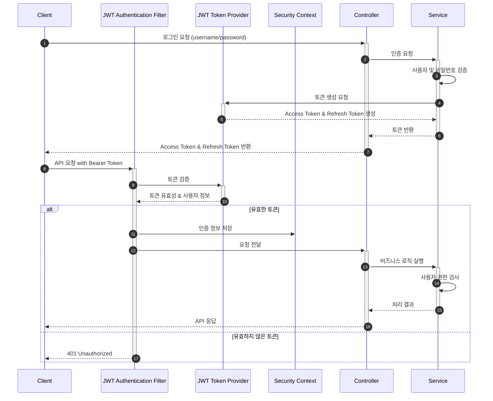
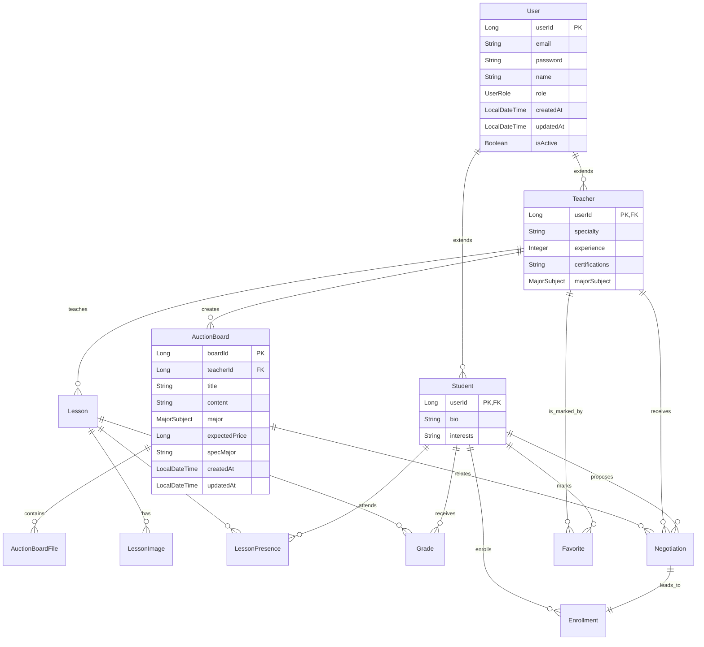

# StuDeal: 학생-교사 과외 매칭 서비스


StuDeal은 학생과 교사 간의 과외 매칭을 지원하는 백엔드 API 플랫폼입니다. 강의 등록, 검색, 협상 및 신청 과정을 제공하여 과외를 매칭할 수 있습니다.

---

## 📋 목차

- [기술 스택](#-기술-스택)
- [주요 기능](#-주요-기능)
- [프로젝트 아키텍처](#-프로젝트-아키텍처)
- [API 명세서](#-api-명세서)
- [개발 역량 하이라이트](#-개발-역량-하이라이트)
- [ERD](#-erd)
- [실행 방법](#-실행-방법)
- [폴더 구조](#-폴더-구조)
- [테스트 전략](#-테스트-전략)
- [향후 발전 계획](#-향후-발전-계획)

---

## 🛠 기술 스택

### Back-end

- **언어 및 프레임워크**: Java 17, Spring Boot 3.4.5
- **데이터베이스**: Oracle, Spring Data JPA, QueryDSL
- **보안**: Spring Security, JWT 기반 인증
- **API 문서화**: Swagger/OpenAPI 3.0
- **유효성 검사**: Bean Validation, Custom Validators
- **빌드 도구**: Gradle 7.6

### DevOps

- **버전 관리**: Git, GitHub
- **코드 품질**: Checkstyle (Google Java Style)

## 🔍 주요 기능

1. **사용자 인증 및 권한 관리**
    - JWT 기반 토큰 인증 시스템
    - 역할 기반 접근 제어(학생/교사)
    - 액세스 토큰 및 리프레시 토큰 관리

2. **사용자 관리**
    - 학생 및 교사 프로필 등록 및 관리
    - 비밀번호 강화 검증
    - 이메일 중복 및 유효성 검사

3. **강의 관리**
    - 강의 등록, 조회, 수정, 삭제
    - 전공 과목별 필터링 및 검색
    - 다양한 조건으로 강의 필터링

4. **수업 신청 및 협상**
    - 학생의 수업 신청
    - 교사와 학생 간 가격/일정 협상 기능
    - 수업 협상 상태 관리

5. **게시판 관리**
    - 공지사항, 자유 게시판 등 다양한 게시판 유형
    - 게시글 작성, 조회, 수정, 삭제

---

## 📐 프로젝트 아키텍처

StuDeal은 계층형 MVC 아키텍처를 사용하여 구현되었습니다:

```
Controller (API) → Service (Business Logic) → Repository (Data Access)
```

- **도메인형 패키지 구조** 적용
- **관심사 분리**를 통한 모듈화된 설계

### 보안 아키텍처



---

## 📚 API 명세서

API는 Swagger/OpenAPI 3.0을 통해 문서화되었습니다:

- **Endpoint**: `/swagger-ui/index.html`
- **OpenAPI 정의**: `/openapi/openapi.json`

---

## 🌟 개발 관련

### 1. 고급 사용자 정의 유효성 검증 시스템

- **비밀번호 강도 검증**: 정규표현식 기반의 복잡성 검증 (8자 이상, 특수문자, 대소문자, 숫자 포함)
- **RFC 5322 표준 준수 이메일 검증**: 엄격한 이메일 형식 검증
- **중복 이메일 검증**: 다중 리포지토리 조회를 통한 이메일 유일성 보장

```java
@StrongPassword(message = "비밀번호는 8자 이상이며 대소문자, 숫자, 특수문자를 포함해야 합니다.")
@StrictEmail(message = "올바른 이메일 형식이 아닙니다.")
@UniqueEmail(message = "이미 사용 중인 이메일입니다.")
```

### 2. 구조화된 API 응답 시스템

- **일관된 응답 형식**: 성공/실패 여부, HTTP 상태, 코드, 메시지 포함
- **명확한 오류 코드 체계**: 비즈니스 오류 코드와 HTTP 상태 코드 분리
- **JSON 포맷 최적화**: `JsonPropertyOrder`를 사용한 응답 구조 정의

```java
{
    "isSuccess":true,
    "httpStatusCode":200,
    "code":"USER200",
    "message":"사용자 정보 조회 성공",
    "result":{ /* 결과 데이터 */ }
    }
```

### 3. JWT 인증 시스템

- **토큰 기반 인증**: 액세스/리프레시 토큰 분리 관리
- **토큰 내 사용자 역할/ID 관리**: 효율적인 권한 검증
- **토큰 생성 및 검증 로직 캡슐화**: `JwtTokenProvider` 활용

### 4. QueryDSL을 활용한 쿼리 최적화

- **타입-세이프 쿼리 작성**: 컴파일 타임 에러 검출
- **동적 쿼리 구성**: 다양한 검색 조건에 따른 최적화된 쿼리 생성
- **복잡한 조인 및 집계 쿼리**: 효율적인 데이터 조회 로직

---

## 📊 ERD



### ERD 설계 개요

- **사용자 도메인(User, Student, Teacher)**: 상속 관계를 통해 공통 속성과 특화된 속성 분리
- **강의 공고(AuctionBoard)**: 교사가 생성하는 수업 제안
- **협상(Negotiation)**: 학생이 참여하는 가격 제안
- **수업 등록(Enrollment)**: 협상 성공 후 생성되는 실제 수업에 대한 등록
- **수업(Lesson)**: 학생에 Enrollment를 통해 참여를 확정할 시 생성되는 수업

---

## 🚀 실행 방법

### 필수 조건

- JDK 17 이상
- Gradle 7.6 이상
- Oracle 데이터베이스 접속 정보

### 실행 단계

1. 레포지토리 클론:

```bash
git clone https://github.com/ryuyeonkyoung/studeal.git
cd studeal
```

2. 애플리케이션 속성 설정:

```yaml
# application-dev.yml 수정
spring:
  datasource:
    url: jdbc:p6spy:oracle:thin:@//your-oracle-server:1521/your-service
    username: your-username
    password: your-password
    driver-class-name: com.p6spy.engine.spy.P6SpyDriver

  jpa:
    properties:
      hibernate:
        dialect: org.hibernate.dialect.OracleDialect
```

3. 애플리케이션 빌드 및 실행:

```bash
./gradlew bootRun
```

4. API 테스트:

```
http://localhost:8080/api/swagger-ui.html
```

---

## 📁 폴더 구조

```
src/main/java/com/studeal/team/
├── domain/                # 도메인별 패키지
│   ├── user/              # 사용자 도메인
│   │   ├── api/           # REST API 컨트롤러
│   │   ├── application/   # 서비스 및 비즈니스 로직
│   │   ├── dao/           # 데이터 액세스 객체
│   │   ├── domain/        # 도메인 모델 및 비즈니스 규칙
│   │   └── dto/           # 데이터 전송 객체
│   ├── lesson/            # 강의 도메인
│   ├── negotiation/       # 협상 도메인
│   └── board/             # 게시판 도메인
├── global/                # 전역 설정 및 유틸리티
│   ├── config/            # 애플리케이션 설정
│   ├── error/             # 예외 처리 및 오류 응답
│   ├── jwt/               # JWT 인증 관련
│   └── validation/        # 커스텀 유효성 검증
└── StuDealApplication.java  # 메인 애플리케이션 클래스
```

---

## 📝 개발자

- **이름**: 류연경
- **역할**: 백엔드 개발자
- **연락처**: ykr.dev@gmail.com
- **GitHub**: [ryuyeonkyoung](https://github.com/ryuyeonkyoung)

---

© 2025 StuDeal. All Rights Reserved.
