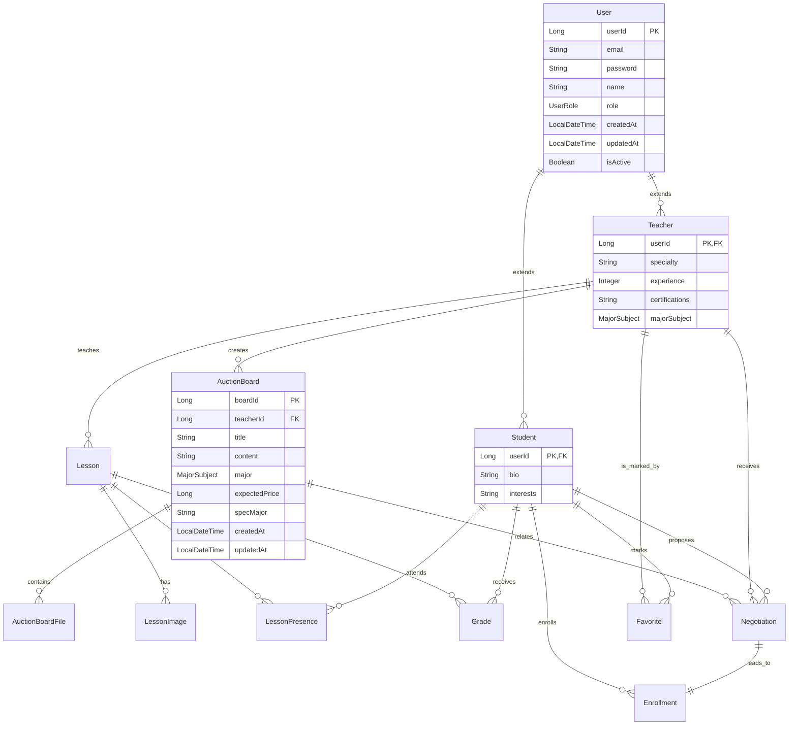

# StuDeal: 학생-교사 과외 매칭 서비스

> StuDeal은 과외 매칭 서비스입니다. 강의 등록, 검색, 경매 및 확정 과정을 거쳐 학생과 교사 간의 과외를 매칭할 수 있습니다.
> <br>**팀 레포지토리**: https://github.com/TeamStuDeal

## 🛠️ 기술 스택


- **언어 및 프레임워크**: Java 17, Spring Boot 3.4.5
- **데이터베이스**: Oracle, Spring Data JPA, QueryDSL
- **보안**: Spring Security, JWT 기반 인증
- **API 문서화**: Swagger/OpenAPI 3.0
- **유효성 검사**: Bean Validation, Custom Validators
- **빌드 도구**: Gradle 7.6


- **버전 관리**: Git, GitHub
- **코드 품질**: Checkstyle (Google Java Style)

---

## ✏️ 주요 기능

1. **사용자 인증 및 권한 관리**
    - JWT 기반 토큰 인증
    - 역할 기반 접근 제어(학생/교사)
    - 액세스 토큰 및 리프레시 토큰 관리

2. **사용자 관리**
    - 학생 및 교사 프로필 등록 및 관리
    - 비밀번호 강화 검증
    - 이메일 중복 및 유효성 검사

3. **강의 관리**
    - 강의 등록, 조회, 수정, 삭제, 검색

4. **수업 신청 및 협상**
    - 교사의 수업 개설
    - 학생의 수업 신청
    - 경매 종료 후 학생의 최종 수업 확정
    - 학생의 수업 결제 (기능 미구현)
    - 수업 개설 및 관리 (기능 미구현)

5. **게시판 관리**
    - 게시글 작성, 조회, 수정, 삭제

---

## 🗒️ API 문서화

Swagger와 OpenAPI 3.0을 통해 API 명세를 관리하였습니다.

- **Endpoint**: `/swagger-ui/index.html`
- **OpenAPI 정의**: `/openapi/openapi.json`

---

## 📜 상세 설계

### 1. 도메인형 패키지 구조 적용

```
src/main/java/com/studeal/team/
├── domain/                # 도메인별 패키지
│   ├── user/              # 사용자 도메인
│   │   ├── api/           # REST API 컨트롤러
│   │   ├── application/   # 서비스 및 비즈니스 로직
│   │   ├── dao/           # 데이터 액세스 객체
│   │   ├── domain/        # 도메인 모델 및 비즈니스 규칙
│   │   └── dto/           # 데이터 전송 객체
│   ├── lesson/            # 강의 도메인
│   ├── negotiation/       # 협상 도메인
│   └── board/             # 게시판 도메인
├── global/                # 전역 설정 및 유틸리티
│   ├── config/            # 애플리케이션 설정
│   ├── error/             # 예외 처리 및 오류 응답
│   ├── jwt/               # JWT 인증 관련
│   └── validation/        # 커스텀 유효성 검증
└── StuDealApplication.java  # 메인 애플리케이션 클래스
```

### 2. Validator와 커스텀 어노테이션을 통한 유효성 검증

- `StrictEmaliValidator`: RFC 5322 표준 준수 이메일 검증 (8자 이상, 특수문자, 대소문자, 숫자 포함)
- `StrongPasswordValidator`: 비밀번호 강도 검증
- `UniqueEmailValidator`: 중복 이메일 검증

**어노테이션 사용 예시:**

```java
@StrongPassword(message = "비밀번호는 8자 이상이며 대소문자, 숫자, 특수문자를 포함해야 합니다.")
@StrictEmail(message = "올바른 이메일 형식이 아닙니다.")
@UniqueEmail(message = "이미 사용 중인 이메일입니다.")
```

### 2. API 응답

```java
{
    "isSuccess":true,
    "httpStatusCode":200,
    "code":"USER200",
    "message":"사용자 정보 조회 성공",
    "result":{ /* 결과 데이터 */ }
    }
```

### 3. QueryDSL을 활용한 쿼리 최적화

- 타입-세이프 쿼리 작성
- 동적 쿼리 구성
- 복잡한 조인 및 집계 쿼리

---

## 📊 ERD


```mermaid
erDiagram
    User ||--o{ Student : extends
    User ||--o{ Teacher : extends
    
    Teacher ||--o{ AuctionBoard : creates
    AuctionBoard ||--o{ AuctionBoardFile : contains
    
    Teacher ||--o{ Lesson : teaches
    Lesson ||--o{ LessonImage : has
    
    Student ||--o{ LessonPresence : attends
    Lesson ||--o{ LessonPresence : tracks
    
    Student ||--o{ Grade : receives
    Lesson ||--o{ Grade : provides
    
    Student ||--o{ Negotiation : proposes
    Teacher ||--o{ Negotiation : receives
    AuctionBoard ||--o{ Negotiation : relates
    
    Negotiation ||--|| Enrollment : leads_to
    Student ||--o{ Enrollment : enrolls
    
    Student ||--o{ Favorite : marks
    Teacher ||--o{ Favorite : is_marked_by
    
    User {
        Long userId PK
        String email
        String password
        String name
        UserRole role
        LocalDateTime createdAt
        LocalDateTime updatedAt
        Boolean isActive
    }
    
    Student {
        Long userId PK,FK
        String bio
        String interests
    }
    
    Teacher {
        Long userId PK,FK
        String specialty
        Integer experience
        String certifications
        MajorSubject majorSubject
    }
    
    AuctionBoard {
        Long boardId PK
        Long teacherId FK
        String title
        String content
        MajorSubject major
        Long expectedPrice
        String specMajor
        LocalDateTime createdAt
        LocalDateTime updatedAt
    }
```

---

© 2025 StuDeal. All Rights Reserved.